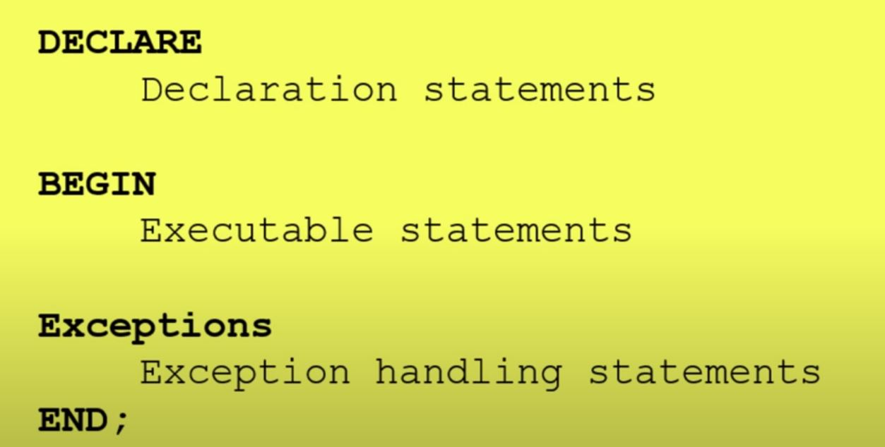
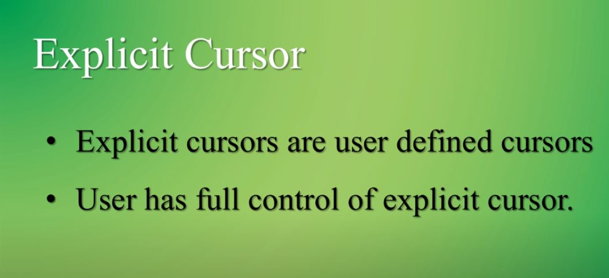
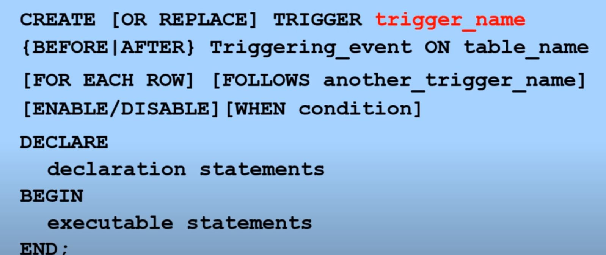

# Introduction
This is for Oracle

Multitenant Environment：多租户环境

CDB（Container Database）：数据库容器

PD（Pluggable Database）：可插拔数据库
# 问题

## sid是什么？
instance id

## instance vs database vs schema?

我们启动oracle的一个instance，就好像启动一个notepad的实例，这个实例完全存在于内存中

然后oracle的instance打开一组文件，就像notepad实例打开test.txt，oracle给这组文件起了一个专门的名字：database

在内存中运行的程序和保存该程序的数据的缓存，我们称之为instance；在硬盘上保留的程序，我们称之为软件，在硬盘上保留的数据，

我们称之为文件。对于oracle，需要一组文件，别且要保持一定的一致性和完整性，这组文件统一有个名字叫database。

Schema/User : A schema is the set of objects (tables, indexes, views, etc) that belong to a user.

[参考](http://blog.itpub.net/193161/viewspace-50212/)

[参考2](https://www.pixelstech.net/article/1481778811-Understanding-database-instance-and-schema-in-Oracle-database)

## CDB vs PDB?
CDB is container database, 

PDB is pluggable database

[参考](https://www.cnblogs.com/siyunianhua/p/4004361.html)
[参考2](https://www.microfocus.com/documentation/borland-connect/3.1/install-help/GUID-74B96B2A-DCBB-4D02-B9CF-CA15F5A3F832.html)
## What are Schema Objects?
Schema objects are tables, views, sequences, synonyms, indexes,databases triggers, procedures, functions, packages.

## What is PL/SQL ?
PL/SQL（Procedural Language/SQL）是甲骨文公司专有的SQL扩展语言，应用在甲骨文公司的Oracle数据库系统。

## What is a cursor ? Why cursor is required ?
cursor是一个变量指针，将查询的结果保存到这个地址中

cursor有两种，隐式和显式，隐式是系统调用的，显式是用户创建和调用的

A cursor is a pointer that points to a result of a query,  pointer to a memory area called context area. 

assigned to hold the information about processing of a SELECT statement or DML statement

PL/SQL has two types of cursors: implicit cursors and explicit cursors.

[参考](https://www.oracletutorial.com/plsql-tutorial/plsql-cursor/)

[Cursor 语法](https://www.youtube.com/watch?v=_snAMqCBitg)

语法

    DECLARE    
        cursor cursor_name IS  select_statement; //Declare a cursor
    BEGIN
        OPEN cursor_name; //Open the cursor
        FETCH cursor_name into PL/SQL variable; //Fetch the cursor
        fetch cursor_name into PL/SQL record;
        CLOSE cursor_name; //Close cursor
    END

[例子](src/main/resources/sql/cursorcreate.sql)

## What is views?
视图是存储在数据字典里的一条select语句。 通过创建视图可以提取数据的逻辑上的集合或组合。

视图是基于一个表或多个表或视图的逻辑表，本身不包含数据，通过它可以对表里面的数据进行查询和修改
[视图（views）](https://www.jianshu.com/p/c6d55ab63364)

## what is index?

An index is uset to performace tunnig in queries. which can be created to increase the performance of data retrieval. 

Index can be created on one or more columns of a table.

关于索引是什么的最简单的比喻是，索引之于表数据如同目录之于一本书。
通过目录的页码我们可以快速的定位一个内容，同样通过索引记录的rowid我们可以快速的定位一条数据。

[Query index](src/main/resources/sql/index-query.sql)

查询有的像查询普通的表一样
## what is anchored type?
Data type which you assign to a variable based on a database object

最常见的是把table的column名assign给变量

语法

    variable_name Typed-attribute %type
举例

    v_fname student.first_name%TYPE;

好处是当table的column类型发生变化时，变量类型也会自动更改

## 如何定义常量？
语法

    constant-name constant datatype (dw) :=value;
 必须定义在declare 区域中
 
## 什么是bind variable?
查询通常只是因为改变where子句中的内容而产生不同的结果。为了在这种情况下避免硬解析，需要使用绑定变量(bind variable)。它是用户放入查询中的占位符

        select * from emp where ename='KING'; //不使用绑定变量
        select * from emp where ename=:bv     //使用绑定变量

## control statements?
 [if statement](src/main/resources/sql/control_statement.sql)
  
 [case statement](src/main/resources/sql/case-statement.sql) 
## How many kinds of loop?

[loop](src/main/resources/sql/loop.sql)

[while-loop](src/main/resources/sql/while-loop.sql)

[for-loop](src/main/resources/sql/forloop.sql)

## What is trigger?
A trigger is a named PL/SQL block stored in the Oracle Database and executed automatically when a triggering event takes place. 

Events

1. DML statement
2. DDL Statement
3. System event
4. user event

syntax of create trigger

注意： 不可以在sys的schema下创建trigger

## SQL四种语言
1. DDL（Data Definition Language）数据库定义语言

- CREATE
- ALTER
- DROP
- TRUNCATE
- COMMENT
- RENAME

2. DML（Data Manipulation Language）数据操纵语言

- SELECT
- INSERT
- UPDATE
- DELETE
- MERGE
- CALL
- EXPLAIN PLAN
- LOCK TABLE

3. DCL（Data Control Language）数据库控制语言  授权，角色控制等
- GRANT 授权
- REVOKE 取消授权

4. TCL（Transaction Control Language）事务控制语言
- SAVEPOINT 设置保存点
- ROLLBACK  回滚
- SET TRANSACTION

## what is function?

[create function](src/main/resources/sql/create_function.sql)

[call function](src/main/resources/sql/call_function.sql)
## what is procedure?
[create procedure](src/main/resources/sql/create_procedure.sql)
[create procedure2](src/main/resources/sql/create_procedure2.sql)

[call procedure](src/main/resources/sql/call_procedure.sql)
[call procedure2](src/main/resources/sql/call_procedure2.sql)

## What are the differences between stored procedure and functions?

| Stored Procedure      | Function |
| ----------- | ----------- |
| Is used to perform business logic.      | Is used to perform the calculation.       |
| Must not have the return type.   | Must have the return type.        |
| May return 0 or more values.   | May return only one value.       |
| The procedure supports input and output parameters.   | The function supports only input parameter.        |
| can use try/catch block | cannot use try/catch block |

## what is package?
a package is a schema object that contains definitions for a group of related functionalities. 

A package includes variables, constants, cursors, exceptions, procedures, functions, and subprograms.

[create package header](src/main/resources/sql/create_package_header.sql)

[create package body](src/main/resources/sql/create_package_body.sql)

## How to backup oracle?
Use rman.exe from oracle bin folder

connect to rman

    rman target /
    
execute backup
    
    backup database;
   
Error

cannot BACKUP DATABASE in NOARCHIVELOG mode

Solutions

    shutdown immediate;
    startup mount;
    alter database archivelog;
    alter database open;
Then redo the backup
 [参考](https://logic.edchen.org/how-to-resolve-rman-06149/)
 
Restore database
    
    restore database;
 
## What is control files?
Every Oracle database has a control file. 
A control file is a small binary file that records the physical structure of the database and includes:

- The database name
- Names and locations of associated datafiles and online redo log files
- The timestamp of the database creation
- The current log sequence number
- Checkpoint information

每当打开数据库时，该控制文件必须可供Oracle数据库服务器写入。没有控制文件，数据库将无法安装，并且恢复困难。

[参考](https://docs.oracle.com/cd/B10501_01/server.920/a96521/control.htm)

## ARCHIVELOG  MODE vs NO-ARCHIVELOG MODE
ARCHIVELOG mode is a mode that you can put the database in for creating a backup of all transactions that have occurred in the database so that you can recover to any point in time.

NOARCHIVELOG mode is basically the absence of ARCHIVELOG mode and has the disadvantage of not being able to recover to any point in time. NOARCHIVELOG mode does have the advantage of not having to write transactions to an archive log and thus increases the performance of the database slightly.

[参考](https://support.arcserve.com/s/article/202080249?language=en_US)

